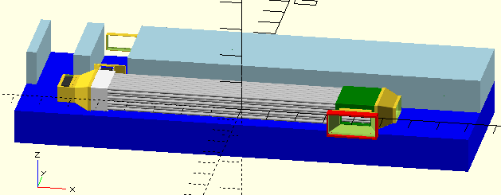
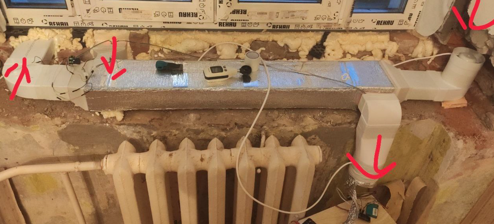

= Комнатный рекуператор

Комнатный рекуператор для установки под подоконник, на или в стену, под потолок и любые другие подходящие места.

Изготавливается из следующих материалов:

1. Комплект деталей, распечатанных на 3д принтере, включая переходники для подсоединения к воздуховоду
1. Алюминиевые трубки диаметром ø10мм с толщиной стенки 1мм
1. Клейкая теплоизоляция
1. Канальные вентиляторы способные создать достаточную тягу
1. Устройство для управления

Воздуховод изготавливается из стандартных вентканалов 110х55 или ø100. Для производительности 60 м3 / ч этого будет достаточно.

Сопротивление теплообменника со 100 трубками длинной 1м составляет порядка 40 Паскаль на вдув и 30 — на выдув.

== Фотографии

Собранный рекуператор может выглядеть так:

== Как сгенерировать 3д модели

Весь проект создан на `OpenSCAD 2021` с использованием библиотеки NopSCADlib.

1. Склонируйте репозиторий
1. Установите OpenSCAD
1. Установите библиотеку NopSCADlib в директорию где OpenSCAD ищет библиотеки.
1. Выполните скрипт `bom.py` и затем `stl.py` из библиотеки `NopSCADlib`.

== Как собирать теплообменник

Некоторые детали генерируются 2 частями и их необходимо склеить. Выбирайте клей по вкусу, отлично подходит АБС-клей на основе ацетона. Необходимо обработать клеем или герметиком все стыки и щели для предотвращения утечек воздуха, иначе можно получить неожиданные результаты в плане .

=== Версия 0.2 (156мм х 82мм)

Тестовая версия, для продува предполагалось использовать 4 серверных вентилятора 40х28. Очень шумно и очень производительно. Для эксплуатации в комнате не подходит.

Детали теплообменника:

1. Трубки: 100 х Aluminium tube 1000x10x1
1. Картриджи для трубок: 2 х ABS_recuperator_tubes_cartridge_156x82
1. Тройники на краях теплообменника:
    - 1 х ABS_square_vent_channel_t_joint_bottom_half_w15x40x10_154x80_42x80_154x80
    - 1 х ABS_square_vent_channel_t_joint_bottom_half_w20x20x20_154x80_103x49_154x80
    - 1 х ABS_square_vent_channel_t_joint_top_half_cut_w15x40x10_154x80_42x80_154x80
    - 1 х ABS_square_vent_channel_t_joint_top_half_w20x20x20_154x80_103x49_154x80
1. Другие детали предназначены для установки сменных фильтров и вентиляторов

